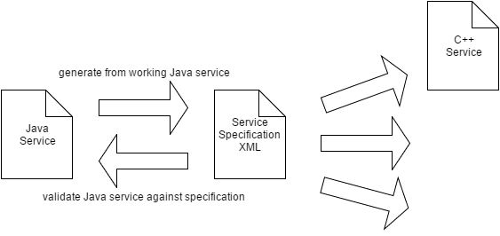
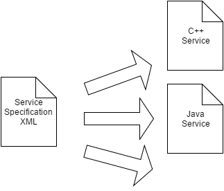

# ez-rpc

Easy RPC between Java and other languages.

The goal of this project is to provide straightforward RPC (remote procedure calls) between applications independent of the programming language or transport layer.

The client and server code can be developed completely unaware of the ez-rpc framework, you only have to be aware of some limitations in the supported data types (a common subset for all languages).

Supported languages:
* Java
* ... (currently under development)

Supported transport layers:
* TCP Sockets
* ... (currently under development)

Supported protocols:
* Java serialization (only between Java applications)
* Binary protocol
* XML (currently under development)
* ...

## Approach

The ez-rpc framework is designed so that the services can be written directly in your favorite programming language (for example Java)
and will work immediately as soon as they are implemented.

The specification of the services is then generated from the running services and can now be published between the different languages.

 

The standard approach to generate services in all participating languages from the specification is of course supported as well.

 


## Service used over RPC

Services consist of method specification that can be executed remotely.

### Java Service Interface

Service interfaces can optionally be annotated to provide additional information for the RPC framework.

The name in the annotation specifies the the standard name which will be used by other programming languages.
For each programming language a specific overriding name may be chosen (for example in Java a fully qualified name with package specification).

```java
@RpcService(name = "HelloService")
public interface HelloService {
	void ping();
	
	double calculateSquare(double value);
	
	@RpcMethod(name = "enrichExample")
	ExampleData exampleMethod(
			@RpcParameter(name = "poor")
			ExampleData exampleData);
}
```

### Java Asynchronous Service Interface

Additionally it is possible to provide a companion interface that specifies the asynchronous methods.
These methods are only available on the client side.
The implementation of the asynchronous methods will automatically be provided by the ez-rpc framework.

```java
public interface HelloServiceAsync {
	CompletableFuture<Double> calculateSquareAsync(double value);
}
```

The asynchronous interface methods can also be used to cancel a call execution on the server.

Simply call `Future.cancel()` on the result of an asynchronous method and a cancel request is sent to the server.

Java based server implementations will interrupt the Thread executing the original request.
Implementations in other languages might or might not be able to comply with the cancelation request. 

## Data structures used over RPC

Data structures over RPC are limited to the most important data types.
* boolean
* int
* long
* double
* string
* list
* set
* map
* custom data structures

### Java Data structure

```java
@RpcStruct(name = "ExampleData")
public class ExampleData {
	public boolean booleanField;
	public int intField;
	public long longField;
	public String stringField;

	@RpcField(element=String.class)
	public List<String> listField;

	@RpcField(element=String.class)
	public Set<String> setField;

	@RpcField(key=Integer.class, value=String.class)
	public Map<Integer, String> mapField;

	public ExampleData nestedExampleData;
}
```

Java data structures may have methods, implement interfaces or use inheritance but none of these informations is transmitted over RPC.

## Adapters

Adapters allow automatic conversion between local types and remote structs.

### Java Adapters

```java
public class BigDecimalAdapter implements Adapter<BigDecimal, BigDecimalStruct> {
	@Override
	public Class<BigDecimal> getLocalType() {
		return BigDecimal.class;
	}

	@Override
	public Class<BigDecimalStruct> getRemoteType() {
		return BigDecimalStruct.class;
	}

	@Override
	public BigDecimalStruct convertLocalToRemote(BigDecimal local) {
		BigDecimalStruct remote = new BigDecimalStruct();
		remote.value = local.toString();
		return remote;
	}

	@Override
	public BigDecimal convertRemoteToLocal(BigDecimalStruct remote) {
		BigDecimal localType = new BigDecimal(remote.value);
		return localType;
	}
}
```

```java
@RpcStruct(name = "BigDecimal")
public class BigDecimalStruct {
	public String value;
}
```

## Configuration

The configuration API is designed to be easy to use in injection frameworks (for example Spring).

### Meta Data Configuration

The meta data is configured independently of the protocol or transport layer.
It specifies the services and data structures used by the RPC.

```java
	public static MetaDataService createMetaDataService() {
		MetaDataService metaDataService = new MetaDataService();
		metaDataService.load(new File("rpc-metadata.xml"));

		metaDataService.addAdapter(new BigDecimalAdapter());
		metaDataService.addAdapter(new DateAdapter());
		metaDataService.addAdapter(new LocalDateTimeAdapter());
		metaDataService.addAdapter(new LocalDateAdapter());
		metaDataService.addAdapter(new PeriodAdapter());

		metaDataService.registerService(HelloService.class);
		
		metaDataService.save(new File("rpc-metadata.xml"));
		
		return metaDataService;
	}
```

### TCP Client Configuration

A typical client configuration needs to specify:
* *MetaDataService* knows about the services and data structures
* *Protocol* specifies how the data is serialized and deserialized
* *Transport* specifies where the server is and how to communicate with it

The ez-rpc framework will then provide proxy implementations for the services that will send the calls to the remote server.

```java
		int port = 5924;
		String hostname = "localhost";
		
		MetaDataService metaDataService = HelloMetaData.createMetaDataService();
		StructureProtocol<Object> protocol = ProtocolFactory.binaryProtocol(metaDataService, HelloServiceImpl.class.getClassLoader());
		SocketClientTransport socketClientTransport = new SocketClientTransport(protocol, hostname, port);
		ServiceFactory serviceFactory = new ServiceFactory(metaDataService);
		
		HelloService proxyService = serviceFactory.createRemoteService(HelloService.class, HelloServiceAsync.class, socketClientTransport);
```

### TCP Server Configuration

A typical server configuration needs to specify:
* *MetaDataService* knows about the services and data structures
* *Protocol* specifies how the data is serialized and deserialized
* *Transport* specifies where the remote client is and how to communicate with it

```java
		int port = 5924;
		
		MetaDataService metaDataService = HelloMetaData.createMetaDataService();
		StructureProtocol<Object> protocol = ProtocolFactory.binaryProtocol(metaDataService, HelloServiceImpl.class.getClassLoader());
		SocketServerTransport socketServerTransport = new SocketServerTransport(metaDataService, protocol, port);
		ServiceFactory serviceFactory = new ServiceFactory(metaDataService);
		
		HelloServiceImpl helloServiceImpl = new HelloServiceImpl();
		serviceFactory.publishService(HelloService.class, helloServiceImpl, socketServerTransport);
```

The ez-rpc framework will then provide proxy implementations for the services that will receive the remote calls and delegate them to your implementation.

## Meta Data

The meta data describes the services and data structures used by the RPC framework.

The meta data file is optional and can be generated automatically from the Java interfaces (with annotations).

Once the meta data file is created it becomes the master specification and the application will validate itself against it on startup.

```xml
<?xml version="1.0" encoding="UTF-8" standalone="yes"?>
<metaData>
    <services>
        <service name="HelloService" javaClass="ch.obermuhlner.rpc.example.api.HelloService">
            <method name="adapterExample">
                <returns>AdapterExampleData</returns>
                <parameter name="data" type="AdapterExampleData"/>
            </method>
            <method name="enrichExample">
                <returns>ExampleData</returns>
                <parameter name="poor" type="ExampleData"/>
            </method>
            <method name="calculateSquare">
                <returns>double</returns>
                <parameter name="arg0" type="double"/>
            </method>
            <method name="ping"/>
        </service>
    </services>
    <structs>
        <struct name="BigDecimal" javaClass="ch.obermuhlner.rpc.meta.adapter.bigdecimal.BigDecimalStruct">
            <field name="value" type="string"/>
        </struct>
        <struct name="EpochMillisecond" javaClass="ch.obermuhlner.rpc.meta.adapter.time.EpochMillisecondStruct">
            <field name="milliseconds" type="long"/>
        </struct>
        <struct name="EpochDay" javaClass="ch.obermuhlner.rpc.meta.adapter.time.EpochDayStruct">
            <field name="days" type="long"/>
        </struct>
        <struct name="Period" javaClass="ch.obermuhlner.rpc.meta.adapter.time.PeriodStruct">
            <field name="years" type="int"/>
            <field name="months" type="int"/>
            <field name="days" type="int"/>
        </struct>
        <struct name="ExampleData" javaClass="ch.obermuhlner.rpc.example.api.ExampleData">
            <field name="booleanField" type="bool"/>
            <field name="intField" type="int"/>
            <field name="longField" type="long"/>
            <field name="stringField" type="string"/>
            <field name="listField" type="list" element="string"/>
            <field name="setField" type="set" element="string"/>
            <field name="mapField" type="map" key="int" value="string"/>
            <field name="nestedExampleData" type="ExampleData"/>
        </struct>
        <struct name="AdapterExampleData" javaClass="ch.obermuhlner.rpc.example.api.AdapterExampleData">
            <field name="bigDecimalField" type="BigDecimal"/>
            <field name="dateField" type="EpochMillisecond"/>
            <field name="localDateTimeField" type="EpochMillisecond"/>
            <field name="localDateField" type="EpochDay"/>
            <field name="periodField" type="Period"/>
        </struct>
    </structs>
</metaData>
```

## Code Generation from Meta Data

Once the meta data file is generated (either from Java interfaces or manually) it is possible to generate the necessary source code from the meta data.

## Java Code Generation

The Java command line tool `ch.obermuhlner.rpc.annotation.generator.java.JavaRpcGenerator` takes one or more XML meta data files as arguments and generates the following source code from it:
* Java service interfaces (annotated with `@RpcService`, `@RpcMethod`, `@RpcParameter`)
* Java companion interface for asychronous methods
* Java struct classes (annotated with `@RpcStruct`, `@RpcField`)

